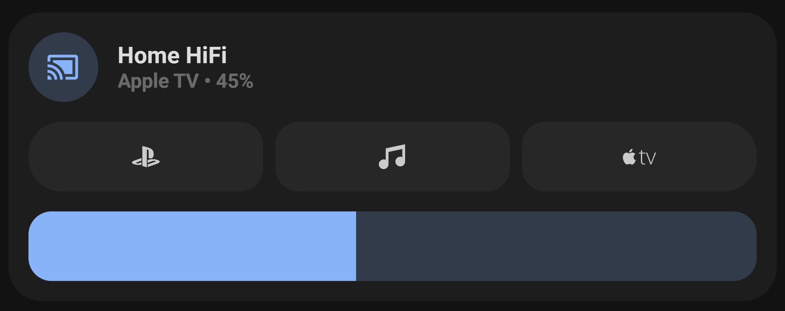

# custom_card_bb-media-player
 A custom media player card featuring 3x buttons (state feedback for source selection coming soon hopefully) & a volume slider.
 
 Planning to hide volume slider when media_player entity is powered off/ in stand by.
 
 *** Note: built for [UI-Lovelace-Minimalist](https://github.com/UI-Lovelace-Minimalist/UI)

Dependancies in current code include:
[hass-fontawesome](https://github.com/thomasloven/hass-fontawesome)
Card is built in a way that suits my Home Assistant install. If you wish to use this card you may have to adapt the source to work with your instance.
